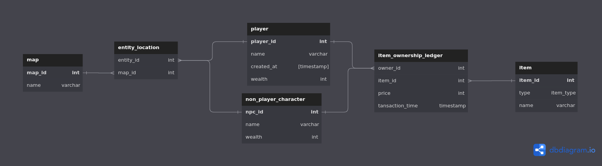

# Optymalizacja Baz Danych

Projekt z przedmiotu optymalizacja baz danych. Relizowany przy pomocy:
* bazy danych Oracle
* klienta bazy danych dbeaver
* skryptów leżących po stronie bazy danych (PL/SQL)

## Struktura bazy danych
Struktura bazy danych jest przedstawiona w folderze `./strucutre`.
Poniżej, graficzny schemat strkutury:

