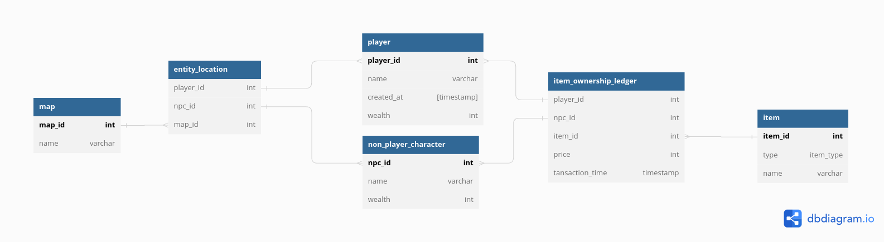

# Optymalizacja Baz Danych

Projekt z przedmiotu optymalizacja baz danych. Relizowany przy pomocy:
* bazy danych Oracle
* clienta bazy danych Cloudbeaver
* skryptów leżących po stronie bazy danych (PL/SQL)

## Cloudbeaver container
Run from this directory, `./applied-physics-labs/optymalizacja-baz-danych/`.
```bash
sudo docker run --name cloudbeaver --rm -ti -p 8080:8978 -v $PWD/cloudbeaver:/opt/cloudbeaver/workspace dbeaver/cloudbeaver:23.0.0
```
Login inside the app.
```text
login: adminadmin
passw: admin
```

## Struktura bazy danych
Struktura bazy danych jest przedstawiona w folderze `./strucutre`.
Poniżej, graficzny schemat strkutury:

